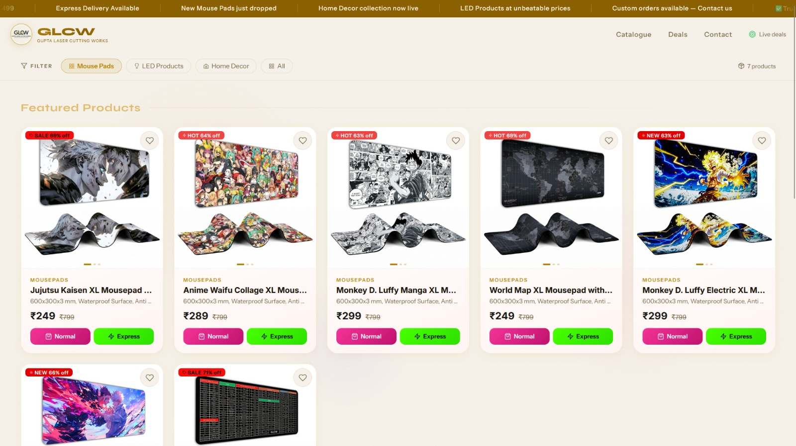
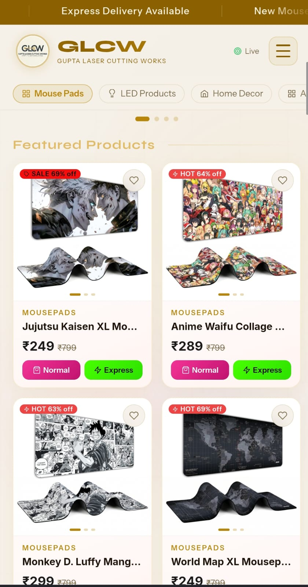

<div align="center">


#  Gupta Laser Cutting Works — E-Commerce Website

**A production-ready e-commerce platform built to bridge Instagram Reels audiences with Amazon product listings.**

[](https://glcw.in/)
[](https://reactjs.org/)
[](https://developer.mozilla.org/en-US/docs/Web/JavaScript)
[](https://glcw.in/)
[](./LICENSE)

</div>

---

## About The Project

**Gupta Laser Cutting Works (GLCW)** is a small business that creates premium laser-cut products — including custom mousepads, LED décor, and home accessories — and promotes them through Instagram Reels.

The problem? There was **no dedicated web presence** to convert that social media traffic into actual buyers.

This project solves that by providing a clean, fast, and fully responsive e-commerce website that:
- Showcases all products in a structured storefront
- Redirects customers seamlessly to Amazon product listings
- Creates a professional digital identity for the brand


---

## 🌐 Live Demo

 **[https://glcw.in/](https://glcw.in/)**

---

##  Features

-  **Product Showcase** — Clean display of all laser-cut products with details
-  **Amazon Redirect Flow** — Smooth transition from site to Amazon listings
-  **Mobile-First Design** — Fully responsive across all screen sizes
-  **Fast Performance** — Optimized for quick load times
-  **SEO Optimized** — Meta tags, Open Graph, and Twitter Card integration
-  **Custom Branding** — Consistent brand colors and logo throughout

---

##  Tech Stack

| Technology | Purpose |
|---|---|
| **React.js** | Frontend UI framework |
| **JavaScript (ES6+)** | Core programming language |
| **CSS3** | Styling & responsive layout |
| **Vercel** | Hosting & continuous deployment |

---

##  Project Structure

```
GLCW-ECOMMERCE-PROJECT/
├── public/               # Static assets (favicon, logo, index.html)
├── src/                  # Source code
│   ├── components/       # Reusable React components
│   ├── pages/            # Page-level components
│   ├── assets/           # Images and media
│   └── App.js            # Root component
├── .gitignore
├── package.json
└── README.md
```

---

##  Getting Started

### Prerequisites

Make sure you have the following installed:
- [Node.js](https://nodejs.org/) (v16 or higher)
- npm or yarn

### Installation

1. **Clone the repository**
   ```bash
   git clone https://github.com/imyash007/GLCW-ECOMMERCE-PROJECT.git
   cd GLCW-ECOMMERCE-PROJECT
   ```

2. **Install dependencies**
   ```bash
   npm install
   ```

3. **Start the development server**
   ```bash
   npm start
   ```

4. **Open in browser**
   ```
   http://localhost:3000
   ```

### Build for Production

```bash
npm run build
```

---

##  Deployment

This project is deployed on **Vercel** with automatic CI/CD from the `main` branch.

The `_redirects` file handles client-side routing:
```
/*    /index.html    200
```

---

##  Screenshots

| Desktop View | Mobile View |
|---|---|
|  |  |


##  Author

**Yash Gupta**

[](https://github.com/imyash007)

---


<div align="center">

Made  for **Gupta Laser Cutting Works**

 If you found this project helpful, please give it a star!

</div>
